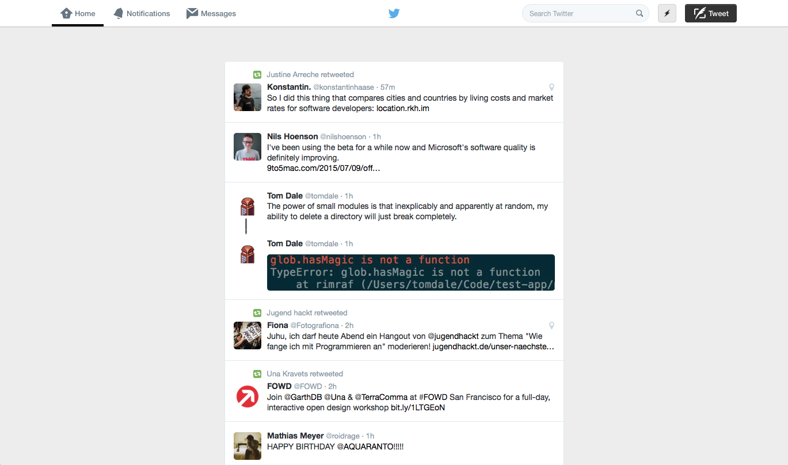

# What?

This repository contains the contents of a Safari Extension of mine, which basically injects a Stylesheet into Twitter's web interface every time you visit it. *Why?* — You might ask... Well, to get rid of the clutter that is distracting you from the content itself.

[This][3] is what I want to achieve soon. 

## How it looks

## "I want that, too!"

1. Simply download the latest version from [here][1]
2. Install & activate it
3. You're finished! — Visit [Twitter][2] to test the extension. :zap:

## Afterword

Sadly, Apple currently doesn't allow for new Safari developers to add extensions to the official Extension Gallery. I also didn't manage to enable auto-updates since I still need to find a way to provide the `update.plist` file from a CDN, so that every instance can check if the releases are available.

[1]: https://github.com/leo/phoenix/releases/latest
[2]: https://twitter.com
[3]: https://dribbble.com/shots/2096401-Twitter-v2
